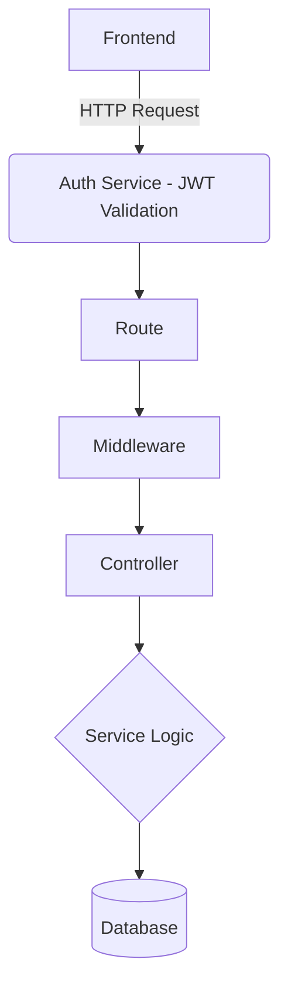

# ⚙️ Architecture & Engineering Standards

> This document defines how systems are structured, built, and scaled. It serves as the **single source of truth** for architecture, setup, and engineering standards across all projects.

---

## 📂 System Structure

Regardless of the stack, we enforce a predictable, decoupled directory structure:

```text
project-root/
├── frontend/          # Next.js Client Application
├── auth/              # Node.js (ExpressKit)
├── backend/           # FastAPI Core Backend
├── worker/            # (optional) Background jobs
├── infra/             # Docker & deployment configs
├── docs/              # Documentation
├── .env.example
└── README.md
```

---

## 🏛️ Layer Rules & Request Flow

To maintain loose coupling and prioritize clarity over cleverness, the application layers must strictly adhere to these responsibilities:

> [!IMPORTANT]
>
> - **Routes** → Endpoints only. No logic.
> - **Controllers** → Parsing and validation only.
> - **Services** → ALL business and domain logic.
> - **Models** → Database interactions only.
> - **Middleware** → Cross-cutting concerns (Auth, Logging, Rate-limiting).

### Standard Request Flow



---

## 🔌 API Standard

All APIs must return this unified JSON response structure. This guarantees the frontend can universally handle success/error states without per-endpoint logic.

```json
{
  "success": true,
  "data": {
    "id": "123",
    "payload": "..."
  },
  "error": null
}
```

> [!WARNING]  
> **HTTP Status Codes MUST align with the payload.**
> Never return a `200 OK` when `"success": false`. Use standard HTTP semantics (e.g., `400`, `404`, `500`) to accurately reflect the state so clients and monitoring tools can correctly intercept failures.

---

## 🛡️ Code & Git Standards

### Code Rules

- **No `any`** in TypeScript. Ever.
- **Strict typing** enforced in Python via Pydantic/MyPy.
- Write **small, pure functions** that are easily testable.
- **No silent failures**. Handle the error or explicitly surface it.

### Git Workflow

Branch naming conventions reflect intent:

- `feature/auth-layer`
- `fix/memory-leak`
- `chore/dependency-bump`

---

## 🚫 Anti-Patterns

> [!WARNING]  
> **DO NOT DO THE FOLLOWING:**
>
> - Writing business logic in controllers.
> - Sharing a single database across distinct microservices without an API boundary.
> - Creating tight coupling between domains.
> - Skipping input validation on external data.

---

## ⚖️ Decision Framework

Before merging a PR or introducing a new architectural pattern, run it through the gauntlet:

1. **Is it scalable?**
2. **Is it simple?**
3. **Is it readable?**
4. **What happens when it fails?**

> [!NOTE]
> **Final Note:** This system is designed so that any engineer can onboard quickly, code remains entirely predictable, and features scale without requiring massive rewrites.
