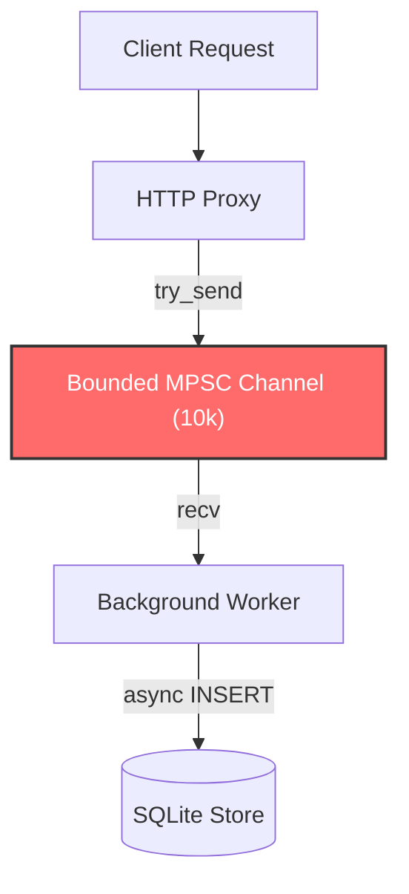
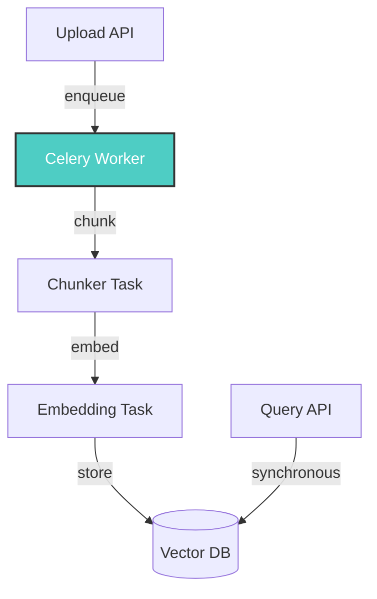
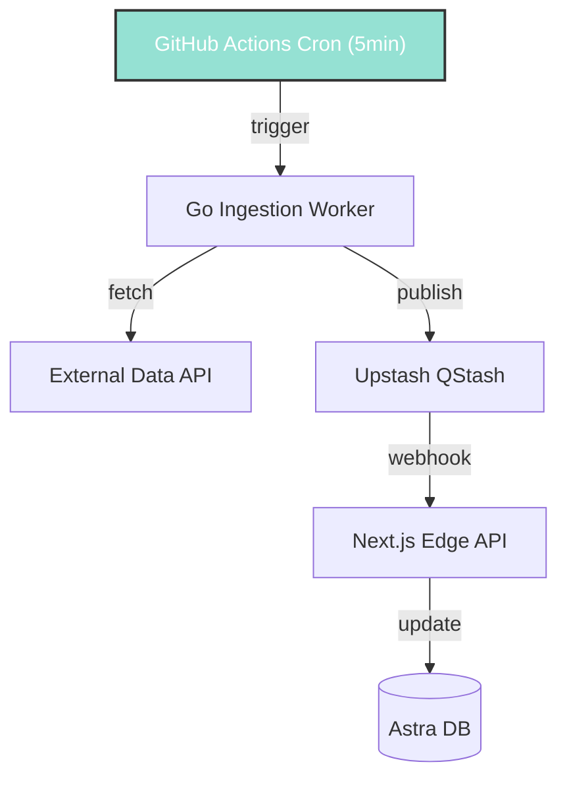
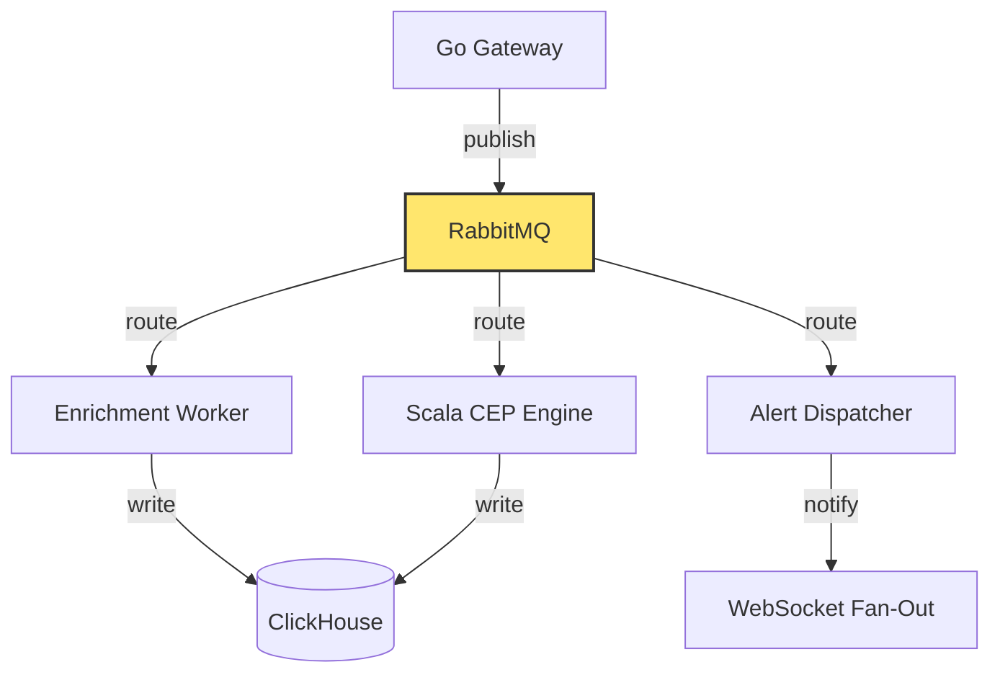

# ⚡ Async & Queues

> **Source Projects:** DevTrace (conveyor belt ingestion), DocsSense (Celery + RabbitMQ), Gaming (QStash), Sentinel (Kafka streaming)
>
> Async architectures decouple producers from consumers, enabling systems to survive traffic spikes, process failures, and slow downstream dependencies without cascading failures.

---

## 1️⃣ The Core Problem

Synchronous request-response models create tight coupling. When a slow database query blocks an API endpoint, every concurrent request queued behind it degrades.

```
Client → API → Database (slow query) → API blocks → All clients wait
```

Async patterns break this chain by introducing a buffer between the producer and consumer.

---

## 2️⃣ Pattern A: Conveyor Belt Ingestion (DevTrace)

### Concept

> [!IMPORTANT]
> For high-velocity, low-latency ingestion, use a bounded channel as a "conveyor belt" between the HTTP listener and the persistence layer.

### Architecture



### Implementation

```rust
// Rust + Tokio
let (tx, mut rx) = mpsc::channel::<RequestLog>(10_000);

tokio::spawn(async move {
    while let Some(log) = rx.recv().await {
        let _ = sqlx::query("INSERT INTO logs ...")
            .bind(...)
            .execute(&pool)
            .await;
    }
});

// In the request handler:
pub fn add(&self, log: RequestLog) {
    if let Err(e) = self.tx.try_send(log) {
        eprintln!("Conveyor belt full! Dropping log: {}", e);
    }
}
```

### Tradeoffs

| Pro | Con |
| :--- | :--- |
| HTTP listener returns in nanoseconds | Events can be dropped if buffer is full |
| Decouples I/O from network | Requires idempotent or loss-tolerant consumers |
| Backpressure prevents OOM crashes | Bounded buffer requires capacity planning |

> [!TIP]
> `try_send` is preferred over `send` in hot paths. If the belt is full, dropping the event and logging is better than blocking the caller and cascading latency.

---

## 3️⃣ Pattern B: Async Task Queues (DocsSense)

### Concept

> [!IMPORTANT]
> For CPU-heavy or multi-step AI pipelines (OCR, chunking, embedding), use a dedicated task queue with eager-mode testing.

### Architecture



### Configuration

```python
# celery_app.py
app = Celery("worker")
app.conf.update(
    broker_url="redis://localhost:6379/0",
    result_backend="redis://localhost:6379/1",
    task_serializer="json",
    result_serializer="json",
)

# Test mode: synchronous execution
app.conf.task_always_eager = True
app.conf.task_eager_propagates = True
```

### Task Definition

```python
@app.task(bind=True, max_retries=3, default_retry_delay=60)
def ingest_document(self, file_path: str, doc_id: str):
    try:
        chunks = chunk_document(file_path)
        embeddings = embed_chunks(chunks)
        store_vectors(doc_id, embeddings)
        return {"status": "completed", "chunks": len(chunks)}
    except ExternalAPIError as exc:
        raise self.retry(exc=exc)
```

### Tradeoffs

| Pro | Con |
| :--- | :--- |
| Natural retry and backoff | Requires broker (Redis/RabbitMQ) |
| Horizontal scaling by adding workers | Debugging distributed failures is harder |
| Eager mode makes testing trivial | Task ordering is not guaranteed |

---

## 4️⃣ Pattern C: Cron-Triggered Serverless Workers (Gaming)

### Concept

> [!IMPORTANT]
> For periodic batch ingestion (sports scores, weather data, match deltas), use a cron-triggered serverless worker instead of a long-running process.

### Architecture



### GitHub Actions Workflow

```yaml
name: Ingest Match Data
on:
  schedule:
    - cron: "*/5 * * * *"  # Every 5 minutes
  workflow_dispatch:

jobs:
  ingest:
    runs-on: ubuntu-latest
    steps:
      - uses: actions/checkout@v4
      - uses: actions/setup-go@v5
        with: { go-version: "1.24" }
      - run: go build -o worker ./cmd/worker
      - run: ./worker ingest
        env:
          ASTRA_DB_TOKEN: ${{ secrets.ASTRA_DB_TOKEN }}
          PANDASCORE_TOKEN: ${{ secrets.PANDASCORE_TOKEN }}
```

### Tradeoffs

| Pro | Con |
| :--- | :--- |
| Zero cost when idle | Cold start latency (mitigated by pre-compiled binary) |
| Native GitHub secrets management | Cron granularity limited to 1 minute |
| No server to maintain | Not suitable for real-time streaming |

---

## 5️⃣ Pattern D: Event-Driven Streaming (Sentinel)

### Concept

> [!IMPORTANT]
> For high-throughput, multi-consumer event streams (IoT telemetry, logs, metrics), use a message broker with topic-based routing.

### Architecture



### Key Considerations

| Aspect | Decision |
| :--- | :--- |
| **Broker** | RabbitMQ for routing + WebSocket fan-out; Kafka for high-volume log streams |
| **Serialization** | Protobuf for strict contracts between Go and Scala services |
| **Consumer Groups** | Multiple consumers can process the same topic independently |
| **Dead Letter Queue** | Failed messages route to `dlq` exchange for later inspection |

> [!WARNING]
> **Idempotency is mandatory.** Message brokers can redeliver messages. Consumers must handle duplicates gracefully using idempotency keys or deduplication windows.

---

## 6️⃣ Choosing the Right Pattern

```
Is the workload real-time and high-velocity?
  → Conveyor Belt (DevTrace)
  
Is it a multi-step CPU-heavy pipeline?
  → Task Queue (DocsSense / Celery)
  
Is it periodic batch ingestion?
  → Cron Worker (Gaming / GitHub Actions)
  
Is it multi-consumer, high-throughput streaming?
  → Message Broker (Sentinel / RabbitMQ or Kafka)
```

---

## 7️⃣ Anti-Patterns

> [!WARNING]
> **DO NOT DO THE FOLLOWING:**
>
> - Using a database as a queue. Databases are not designed for FIFO consumption semantics.
> - Making synchronous HTTP calls inside a background worker without timeouts. A slow downstream API will exhaust your worker pool.
> - Ignoring dead letter queues. Unprocessed messages will silently disappear, creating data gaps.
> - Running a single worker process in production. Workers crash; use a process manager or container orchestrator.

---

## 8️⃣ Reference Implementations

| Repo | Pattern | Stack |
| :--- | :--- | :--- |
| **DevTrace** | Conveyor Belt | Rust, Tokio MPSC, SQLite |
| **DocsSense** | Task Queue | Celery, Redis, RabbitMQ, FastAPI |
| **Gaming** | Cron Worker | Go, GitHub Actions, QStash |
| **Sentinel** | Event Streaming | RabbitMQ, Kafka, Scala ZIO, Protobuf |
| **BlackIce** | Polyglot Mesh | RabbitMQ, Go gateway, Rust engine, Python optimizer |
