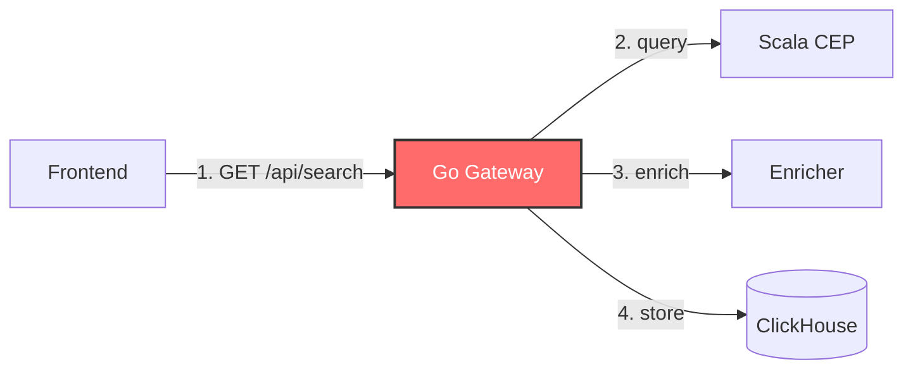

# 🔭 Observability

> **Source Projects:** DevTrace (observability engine), Gaming (edge threat model), Sentinel (Grafana/Prometheus), SentinalMesh (metrics pipeline)
>
> Observability is not just logging. It is the ability to understand the internal state of a system from its external outputs — logs, metrics, and traces.

---

## 1️⃣ The Three Pillars

### Logs

Structured, queryable records of discrete events.

```json
{
  "timestamp": "2026-08-12T14:32:01.123Z",
  "level": "info",
  "service": "ingestion-worker",
  "trace_id": "abc-123-def-456",
  "message": "Document ingested successfully",
  "duration_ms": 342,
  "doc_id": "550e8400-e29b"
}
```

> [!IMPORTANT]
> Every log entry MUST contain `timestamp`, `service`, and `trace_id`. Without these, debugging distributed systems is impossible.

### Metrics

Numeric measurements over time: latency, error rates, throughput, saturation.

| Metric Type | Example | Alert Threshold |
| :--- | :--- | :--- |
| **Latency** | P95 request duration | > 500ms |
| **Error Rate** | 5xx responses / total requests | > 1% |
| **Throughput** | Requests per second | < 10 (unusual drop) |
| **Saturation** | Queue depth, CPU, memory | > 80% |

### Traces

End-to-end request paths across services, correlated by `trace_id`.



---

## 2️⃣ Observability Patterns

### Pattern A: Embedded Observability (DevTrace)

> [!TIP]
> Build observability directly into the tool, not as an afterthought. DevTrace intercepts traffic at the proxy layer and stores it in a queryable SQLite event store.

#### Key Features

- **Conveyor Belt Ingestion:** Zero-copy capture via Tokio MPSC channels (10k buffer)
- **SQL-Backed Query Engine:** Filter by status, method, path, sort by duration
- **Dual-Format Timestamps:** Human-readable UTC + microsecond epoch
- **Embedded Dashboard:** Next.js UI served directly from the Rust binary

#### Query Patterns

```
GET /logs?status=500          # Find all failed requests
GET /logs?method=POST         # Audit state-changing traffic
GET /logs?sort=duration&limit=10  # Top 10 slowest endpoints
```

---

### Pattern B: Edge-First Defense (Gaming)

> [!IMPORTANT]
> Rate limiting at the edge prevents DDoS and database exhaustion before the request reaches your application.

#### Implementation

```typescript
// middleware.ts
import { Ratelimit } from "@upstash/ratelimit";
import { Redis } from "@upstash/redis";

const ratelimit = new Ratelimit({
  redis: Redis.fromEnv(),
  limiter: Ratelimit.slidingWindow(20, "10 s"),
  analytics: true,
});

export async function middleware(request: NextRequest) {
  const ip = request.headers.get("x-forwarded-for") ?? "unknown";
  const userId = (await auth()).userId ?? "anonymous";
  
  const { success } = await ratelimit.limit(`${ip}:${userId}`);
  if (!success) return new Response("Too Many Requests", { status: 429 });
}
```

#### Webhook Verification

```typescript
// api/webhook/route.ts
import { verifyQStashSignature } from "@upstash/qstash";

export async function POST(request: Request) {
  const signature = request.headers.get("Upstash-Signature");
  const body = await request.text();
  
  if (!verifyQStashSignature({ body, signature, key: process.env.QSTASH_SIGNING_KEY })) {
    return new Response("Invalid signature", { status: 400 });
  }
  
  // Process webhook
}
```

---

### Pattern C: Infrastructure Monitoring (Sentinel)

> [!TIP]
> Monitor the platform, not just the application. Use Grafana + Prometheus for infrastructure metrics and ClickHouse for application logs.

#### Stack

| Component | Purpose | Technology |
| :--- | :--- | :--- |
| **Metrics** | System health, request rates, latency | Prometheus + Grafana |
| **Logs** | Application logs, audit trails | ClickHouse |
| **Alerting** | PagerDuty, Slack, email | Grafana Alerting |
| **Tracing** | Distributed request paths | OpenTelemetry |

#### Key Dashboards

1. **Infrastructure Health:** CPU, memory, disk, network per service
2. **API Performance:** P50/P95/P99 latency, error rates by endpoint
3. **Database:** Query throughput, connection pool saturation, slow queries
4. **Message Broker:** Queue depth, consumer lag, dead letter queue size

---

## 3️⃣ Alerting Philosophy

### The Four Golden Signals

Google's SRE book defines four signals that matter for all services:

1. **Latency:** Time to serve requests (distinguish success vs. failure)
2. **Traffic:** Demand on your system (requests per second)
3. **Errors:** Rate of failed requests
4. **Saturation:** How "full" your service is (CPU, memory, queue depth)

### Alert Tiers

| Tier | Response Time | Channel | Example |
| :--- | :--- | :--- | :--- |
| **P1 — Critical** | < 5 min | PagerDuty + Slack | Database down, 100% error rate |
| **P2 — Warning** | < 30 min | Slack | P95 latency > 1s, queue depth > 10k |
| **P3 — Info** | Next business day | Email | Deprecation warnings, quota approaching |

### Alert Fatigue Prevention

> [!WARNING]
> Every alert must require a human action. If an alert fires and the engineer's response is "I'll look at it later," the alert is noise.

- **Page on symptoms, not causes.** Alert on "error rate > 1%" not "CPU > 90%" (unless CPU is the symptom).
- **Silence during deploys.** Automatically mute alerts during planned maintenance windows.
- **Runbook every alert.** Every alert page must link to a runbook with investigation steps and escalation paths.

---

## 4️⃣ Logging Standards

### Structured Logging

```json
{
  "timestamp": "2026-08-12T14:32:01.123Z",
  "level": "error",
  "service": "api-gateway",
  "trace_id": "abc-123-def-456",
  "span_id": "span-789",
  "message": "Failed to process payment",
  "error": {
    "type": "PaymentDeclinedError",
    "message": "Insufficient funds",
    "stack": "PaymentDeclinedError: Insufficient funds\n    at..."
  },
  "context": {
    "user_id": "usr_123",
    "amount": 4999,
    "currency": "USD"
  }
}
```

### Log Levels

| Level | Purpose | Example |
| :--- | :--- | :--- |
| **DEBUG** | Detailed diagnostic info | "Cache miss for key user:123" |
| **INFO** | Confirmation of expected behavior | "Payment processed successfully" |
| **WARN** | Unexpected but handled conditions | "Retry attempt 2/3 for downstream API" |
| **ERROR** | Failures that need attention | "Database connection pool exhausted" |
| **FATAL** | System is unusable | "Cannot bind to port 443 — another process is using it" |

> [!NOTE]
> Never log secrets, API keys, tokens, or PII. Redact sensitive fields before writing to the log stream.

---

## 5️⃣ Reference Implementations

| Repo | Pattern | Highlights |
| :--- | :--- | :--- |
| **DevTrace** | Embedded Observability | Conveyor belt ingestion, SQL-backed query, embedded Next.js dashboard |
| **Gaming** | Edge Defense | Upstash rate limiting, QStash webhook verification, defense-in-depth |
| **Sentinel** | Infrastructure Monitoring | Grafana/Prometheus dashboards, ClickHouse log sink, WebSocket alerts |
| **SentinalMesh** | Metrics Pipeline | EWMA z-score scoring, matched counterfactual control, simulation metrics |
